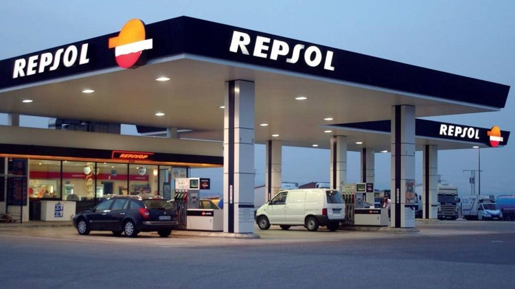

# Precio de la gasolina en España

En 2023 los precios promedio de los carburantes en España cayeron arrastrados por las caídas de los mercados internacionales. La gasolina 95 decreció un 8,2% respecto a 2022 mientras que el gasóleo A decreció un 13,2%.

Los datos analizados en este proyecto son una muestra de 1000 gasolineras de una lista más extensa que contiene la totalidad de las estaciones de carburante del país. Estos datos han sido recabados entre los días 19, 20 y 21 de noviembre de 2023 e insertados en la base de datos el 22 de noviembre de 2023. Concretamente el dataset puede descargarse mediante el siguiente enlace 👉 https://datamarket.es/#gasolineras-dataset 

Después de analizar la información de esta muestra me han surgido las siguientes preguntas:

🔎​ ¿Cuál es la provincia con más gasolineras? ¿Y la provincia con menos gasolineras?

🔎​ ¿Número de gasolineras por provincia?

🔎​ ¿Qué compañía tiene más gasolineras?

🔎​ ¿Dónde se encuentra la gasolinera con el precio más alto de gasolina 95? ¿Y la dirección de la gasolinera con el precio más bajo de gasolina 95?

🔎​ ¿Cuántos tipos de gcombustible se comercializan al público?

🔎​ ¿Cuál es el tipo de combustible que menos se comercializa en las gasolineras?

🔎​ ¿Número de gasolineras por tipo de combustible?

🔎​ ¿Cuántas gasolineras están abiertas 24h?

🔎​ ¿Cuál es el precio medio por tipo de combustible?

